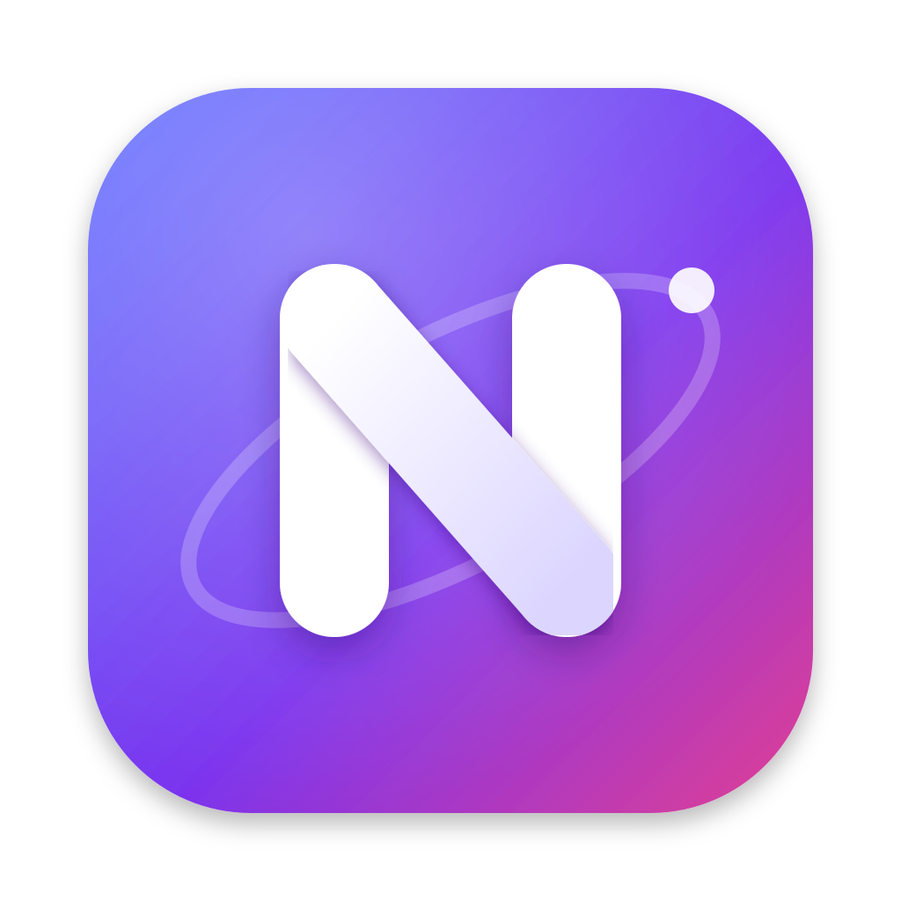
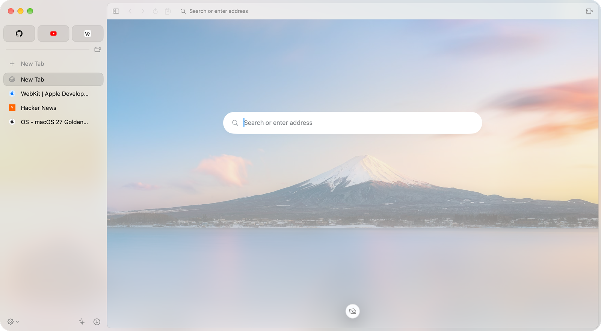
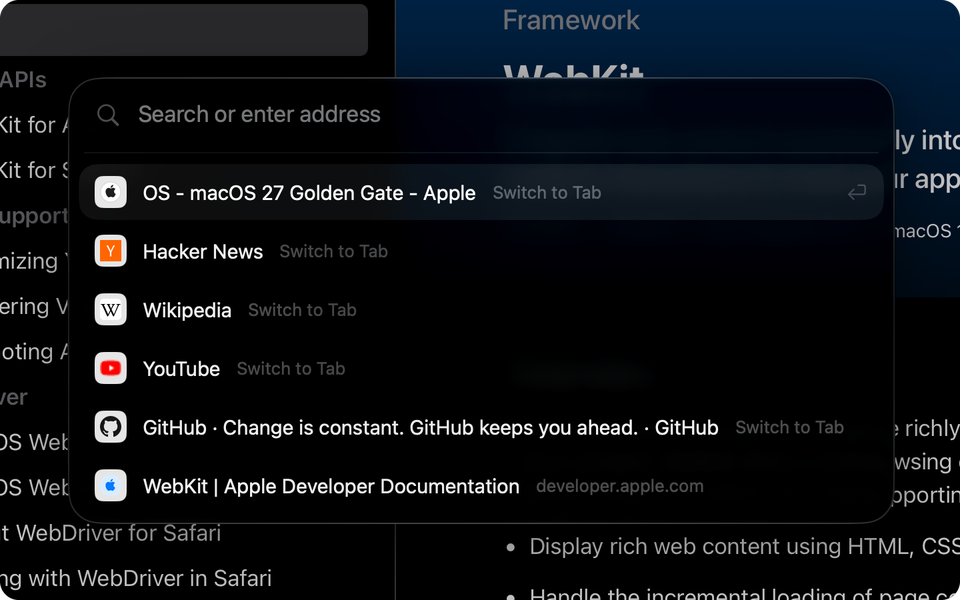
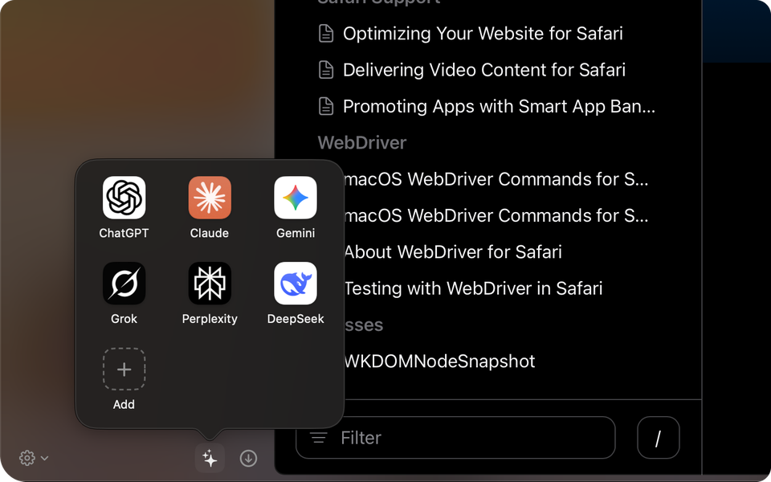
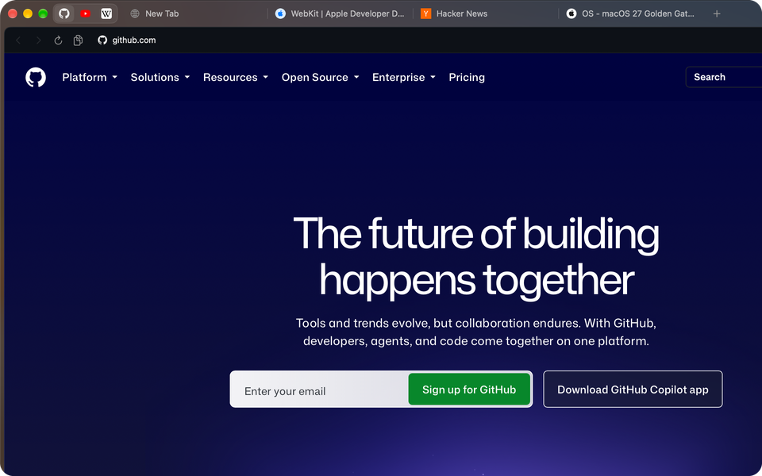
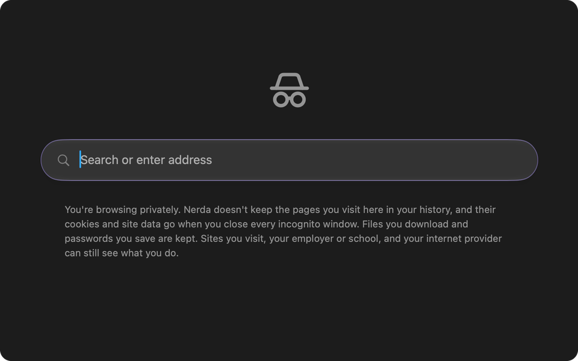

<p align="center">
  
</p>

<h1 align="center">Nerda</h1>

<p align="center">
  <strong>A light, quick web browser for the Mac.</strong><br>
  Tabs in a sidebar, Chrome extensions and an ad blocker, on the WebKit engine that ships with macOS.
</p>

<p align="center">
  <a href="https://github.com/kamafozilov/nerda.browser/releases/latest"></a>
  
  
  <a href="LICENSE"></a>
</p>

<p align="center">
  <a href="https://github.com/kamafozilov/nerda.browser/releases/latest/download/Nerda.dmg"><strong>Download for macOS</strong></a>
  &nbsp;·&nbsp;
  <a href="#features">Features</a>
  &nbsp;·&nbsp;
  <a href="CHANGELOG.md">What's new</a>
  &nbsp;·&nbsp;
  <a href="#build-it-yourself">Build it yourself</a>
</p>

<br>

<picture>
  <source media="(prefers-color-scheme: dark)" srcset="docs/images/new-tab-dark.png">
  
</picture>

<br>

Nerda is a browser that stays out of the way. It is a native Mac app written in Swift on WebKit, the engine Safari uses, so it is a **7.5 MB download** rather than the few hundred megabytes a Chromium browser brings with it. There is no account to make and nothing to sign in to: your tabs, history and bookmarks stay in a folder on your Mac.

<table>
  <tr>
    <td width="33%" valign="top"><b>🪶 Light</b><br>Tabs out of sight go to sleep and give their memory back. Closed tabs free theirs at once.</td>
    <td width="33%" valign="top"><b>🛡️ Private</b><br>Ads and trackers blocked out of the box. Incognito windows lock behind Touch ID.</td>
    <td width="33%" valign="top"><b>🧩 Familiar</b><br>Arc's sidebar and bookmarks, Chrome's extensions and shortcuts, Safari's engine.</td>
  </tr>
</table>

## Features

<table>
  <tr>
    <td width="50%"><br><b>Search Tabs</b> (⇧⌘A) finds any open tab, or opens a site or a search.</td>
    <td width="50%"><br><b>AI chats</b> one click away, at the foot of the sidebar.</td>
  </tr>
  <tr>
    <td width="50%"><br><b>Tabs across the top</b>, if you'd rather, with pinned sites by the traffic lights.</td>
    <td width="50%"><br><b>Incognito windows</b> keep nothing, and lock when you step away.</td>
  </tr>
</table>

### Tabs your way

- **A sidebar of tabs**, newest first, on the system's glass. Collapse it with ⌘S and it slides out over the page from the window's edge. Or put the tabs **across the top**, as in Chrome.
- **Pinned sites** sit as tiles above your tabs, load when Nerda opens and never sleep.
- **Bookmarks as in Arc**: drag a tab above the line to keep it. It opens in its own place and stays when you close it. Folders nest, and File › Import Bookmarks… brings yours from Chrome, Safari, Firefox or Arc.
- **Rest the pointer on a tab** for a card with a picture of its page and how much memory it takes. Double-click a tab to give it a name of your own.
- **Your tabs come back** after you quit, after an update and after a crash, with their history, scroll position and zoom.

### Quick, and easy on the battery

- **Sleeping tabs**: a tab out of sight for 30 minutes, or any tab when memory runs short, frees its memory and wakes when you come back to it. A hidden tab that keeps the processor busy (an ad gone wrong) is put to sleep.
- **120 frames a second** on a ProMotion screen, where WebKit holds pages near 60; back to 60 in Low Power Mode.
- **Sites start connecting while you type** their address, or when the pointer rests on a link to one, so they open sooner.
- Measured, not guessed: `./bench.sh` times launch, tab switches, typing and memory before and after each change.

### Private by default

- **Ads and trackers blocked** with EasyList and EasyPrivacy. Pick more lists from uBlock Origin's catalogue (AdGuard, malware, cookie notices, regional lists) or add your own in Settings › Security & Privacy.
- **Incognito windows** (⇧⌘N) keep no history and forget their cookies once the last one closes. They lock when the Mac sleeps or after a minute away, and open again with Touch ID.
- **Delete browsing data** from the last 15 minutes to all time, choosing what goes: history, cache, downloads, cookies, site storage.
- **Passwords** are offered for saving and filled in from the login keychain. File › Import Passwords… reads the CSV from Passwords, Safari or Chrome.
- A page can't open tabs on its own, only after a click or a key.

### Chrome extensions

Open an extension's page in the Chrome Web Store and press **Add to Nerda**. Dark Reader, password managers and the rest sit behind the puzzle button beside the address bar, pinned there if you like. They update themselves and stay out of incognito windows, as in Chrome.

### For developers

- **Web Inspector**, JavaScript Console and Inspect Element (⌥⌘I, ⌥⌘J, ⌥⌘C), as in Chrome.
- **Responsive Design Mode** (⌥⌘R): a phone, a tablet or any size you type or drag, and sites send their mobile pages.
- **Local projects open as typed**: `localhost:3000`, `127.0.0.1:5173`, `[::1]:8080`, with the port picked out in amber.
- **View Page Source** (⌥⌘U), JSON shown as a coloured tree, Disable JavaScript and Clear Site Data per tab.

### And the small things

- A new tab opens on a photo, blurring into the window. Pick another, take a new one each day, or add your own.
- Auto Picture in Picture, in Settings › General: a playing video floats over your windows when you switch tabs, or apps.
- Swipe back and forward with two fingers, as in Chrome; a mouse's side buttons work too.
- Nerda updates itself: a card in the sidebar shows the new version, and What's New shows what it brings.

## Install

1. [**Download Nerda.dmg**](https://github.com/kamafozilov/nerda.browser/releases/latest/download/Nerda.dmg) and drag Nerda to Applications.
2. Open it. Nerda isn't notarized by Apple yet, so the first time macOS may say it can't check it: open **System Settings › Privacy & Security**, scroll to Nerda and click **Open Anyway**. You only do this once.
3. Make it your default browser from the card at the top of Settings (⌘,).

Nerda runs on **macOS 15.4 or later**, on Apple silicon and Intel Macs. From then on it keeps itself up to date.

> [!NOTE]
> Nerda is young: versions are 0.0.x until the public 1.0, and new ones come often. Every change is in the [changelog](CHANGELOG.md).

## Keyboard shortcuts

| Tabs | | Page | | Window | |
|---|---|---|---|---|---|
| New tab | ⌘T | Open location | ⌘L | Incognito window | ⇧⌘N |
| Close tab | ⌘W | Find | ⌘F | Show all history | ⌘Y |
| Search tabs | ⇧⌘A | Hard reload | ⇧⌘R | Settings | ⌘, |
| Go to tab 1–8 | ⌘1–⌘8 | Zoom | ⌘+ ⌘− ⌘0 | Developer tools | ⌥⌘I |
| Collapse tabs | ⌘S | Bookmark page | ⌘D | Responsive design | ⌥⌘R |

Settings › Keyboard Shortcuts lists them all.

## Build it yourself

Nerda has no dependencies beyond Apple's frameworks, and Xcode isn't needed: the Command Line Tools with Swift 6.2 are enough.

```bash
git clone https://github.com/kamafozilov/nerda.browser.git
```

```bash
cd nerda.browser && ./build.sh debug && open "build/Nerda Dev.app"
```

`./build.sh debug` makes **Nerda Dev**, a separate app with its own data, so it never touches the tabs and passwords of the Nerda you use. `./watch.sh` rebuilds and reopens it every time you save, and `swift test` runs the tests.

How the pieces fit and why: [docs/decisions.md](docs/decisions.md). Opening a pull request: [docs/pull-requests.md](docs/pull-requests.md).

## Thanks

- [Search](https://github.com/driceroland/Search) (MIT), whose work on Chrome extensions in WebKit Nerda builds on.
- [EasyList and EasyPrivacy](https://easylist.to), and the lists of [uBlock Origin](https://github.com/gorhill/uBlock)'s catalogue.
- Romain Guy, for the [photo of Mount Fuji](https://commons.wikimedia.org/wiki/File:Mount_Fuji_at_sunset,_March_2025.jpg) (CC0) on every new tab.

## Licence

[MIT](LICENSE) © 2026 Kamron
